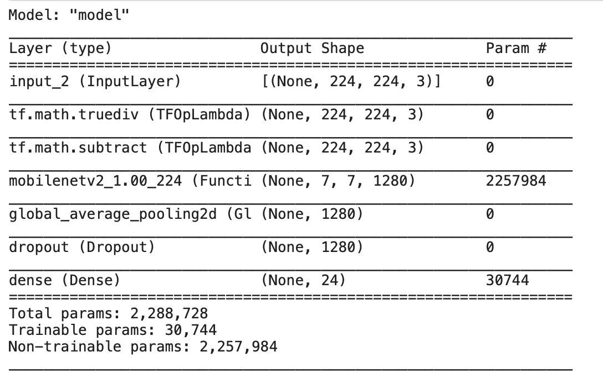

# Introduction 

American Sign Language (ASL) is the primary language used by many deaf individuals in North America, and it is also used by hard-of-hearing and hearing individuals. The language is as rich as spoken languages and employs signs made with the hand, along with facial gestures and bodily postures. In this project I will build ASL prediction model. 

# Related Works

A lot of recent progress has been made towards developing computer vision systems that translate sign language to spoken language. This technology often relies on complex neural network architectures that can detect subtle patterns in streaming video like Real-time American Sign Language Recognition with Convolutional Neural Networks[@01_paper], American Sign Language Alphabet Recognition using Deep Learning[@02_paper].

# Proposed Work

Using ASL images from Kaggle[@03_dataset], build Neural Network model with Tensorflow frame work.

Below is examples images from Kaggle dataset:  

Each image is numbered from 0 to 25 which is matched for alphabet A to Z such as `(0, A), (1, B), (2, C)`

Since Label is categorical variable, Labels should be encoded as one-hot encoded like below :

\begin{table}[ht]
\centering
\begin{tabular}{rrl}
  \hline
 & Lables & One Hot Encoded \\ 
  \hline
  1 & A 0 & [1, 0, 0] \\ 
  2 & B 1 & [0, 1, 0] \\ 
  3 & C 2 & [0, 0, 1] \\ 
  4 & A 0 & [1, 0, 0] \\ 
   \hline
\end{tabular}
\end{table}

To Define model I will use Transfer Learning method with MobileNetV2 and add Global Average Pooling, Dropout Layer to avoid overfit. Train was being processed with 70% of datasets (16,800 sets), 15% is for validation set (3,600 sets) and I will use other 15% to test (3,600 set) the model.

Below is a sturcture of model. Model is compiled with Adam Optimizer, 0.0001 Learning Rate, SparseCategoricalCrossentropy Loss function and Accuracy metrics.  

Below is loss/accuracy for train and validation sets.
With only 5 epochs, accuracy for each data set is 99.6%, 99.8%
loss for each data set is 0.09, 0.06  

# Evalutaion

To evaluate model, I will use 15% of datasets that has never been used to be trained for model.

The Accuracy of test is about 99.99% for model.  

Belows are expamples of predictions  

# Code for Report

  
  

  

  

  

# Discussion & Conclusion

I build model which predict only one alphabet, and training epoch only 5 times. Prediction results is very impressive considering its epoch.

However this is just first step to predict ASL. Predicting one letter at a time will not be very helpful in real life. I think it is necessary to develop a model that can translate one word or one sentence in real time.

Deviating from the image classification problem model, Using Object Detection model such as YOLO or CoCoSSD.

---
references:

- id: 01_paper
  title: Real-time American Sign Language Recognition with Convolutional Neural Networks
  author:
  - family: Garcia
    given: Brandon
  URL: 'http://cs231n.stanford.edu/reports/2016/pdfs/214_Report.pdf'
  type: article-journal

- id: 02_paper
  title: American Sign Language Alphabet Recognition using Deep Learning
  author:
  - family: Kasukurthi
    given: Nikhil
  URL: 'https://arxiv.org/pdf/1905.05487.pdf'
  type: article-journal

- id: 03_dataset
  title: Sign Language (ENG Alphabet)
  author:
  - family: Ruslan
    given: Bredun
  URL: 'https://www.kaggle.com/datasets/ruslanbredun/sign-language-eng-alphabet'
  type: url

...
---

